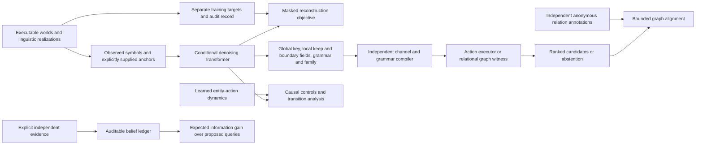

# Communication-system inference workbench

This implements the computational core of the [world-model/diffusion research program](research/world-models-diffusion-2026-09-21/SYNTHESIS.md): executable document-producing systems, joint masked inference, a learned action world model, compiler checks, causal analysis, relational grounding and active evidence selection. The latest user instruction authorizes implementation and bounded local training. The original research dossier records the earlier research-only stage.

## Architecture and data flow



The package lives in `src/voynich/communication/`. It adds a distinct research pipeline without altering the existing Voynich language model, null-removal models, frozen corpus split or ongoing experiments.

| Module | Executable responsibility |
| --- | --- |
| `worlds.py` | Typed entity/action simulation; procedure, taxonomy and structured-copy documents; six grammatical role orders; prefix/suffix/no role morphology; random homophonic channels; globally licensed nulls; exact alignments; independent grammar parser and semantic witnesses |
| `schema.py` | Strict versioned observations; explicit anchor provenance; joint latent slot layout and per-field support; immutable observed data; unresolved unseen key entries |
| `denoiser.py` | Conditional bidirectional Transformer, masked reconstruction training, explicit revisiting of committed guesses, fixed anchors, support constraints, trajectories and activation hooks |
| `pipeline.py` | Leakage-safe generated episodes, coupled hypotheses, documented consistency projection, exact channel/compiler checks, ranked candidates and abstention |
| `search.py` | Bounded compiler-guided global-key/grammar search with explicit expansion limits and incomplete-search status |
| `dynamics.py` | Learned entity-permutation-equivariant action model predicting state changes and action applicability; executor-labeled supervision |
| `training.py`, `action_training.py` | Finite training, checkpointing, reproducibility manifests, isolated validation and resource limits |
| `evaluation.py` | Candidate selection before consulting gold; trained/untrained and channel baselines; honest denominators and ambiguity limitations |
| `interpretation.py` | Targeted, identity, donor and norm-matched random interventions; behavioral distribution comparisons; explicit supervised transition-program extraction |
| `grounding.py` | Anonymous relational graph alignment with ties, provenance and bounded search; no guessed botanical names |
| `evidence.py` | Stable finite Bayesian updates, duplicate/dependent evidence rejection, entropy and expected information gain per query cost |
| `adapters.py` | Read-only conversion of registered manuscript train/validation observations; no scoring or final-test access |
| `__main__.py` | Command-line integration of the components |

## What the first implementation represents

A generated document has a global channel shared across its full observation. Unknown symbols cannot receive a different meaning every time they occur. Nulls belong to declared symbol classes; the compiler refuses arbitrary local deletion inconsistent with the global key. Several observed symbols may realize the same canonical symbol. In this version the channel is stateless; a request for `stateful=True` fails explicitly.

The latent inference state includes the inverse channel, aligned keep and word-start flags, grammatical role order, morphological realization and document family. PAD and artificial MASK are distinct from latent values. A key entry whose observed symbol never appears and has no explicit anchor remains unresolved and contributes no supervised recovery target. The input condition contains only observed symbols and declared anchor correspondences. Regeneration seeds, family labels, true keys and actions stay in a separate audit record.

The procedure executor tracks anonymous agents, vessels, material locations and temperature categories. It enforces the preconditions and consequences of transfer, heat and cool. The taxonomy executor finds compatible small rooted trees. The copy family supplies structured surfaces without an attached referent world. These are explicit research domains; their existence does not establish that the manuscript belongs to any of them.

Grammar parsing and action/taxonomy witnesses use candidate rules, not a hidden gold example. Finding a compatible initial state establishes consistency with the declared domain, not that the initial state or domain is historically correct. Re-encoding is checked separately and is never sufficient for acceptance as a decipherment.

The learned action model uses entity roles and current state without an absolute entity-position embedding. Renaming entities must permute predictions. Illegal actions train the applicability head; they contribute zero next-state loss. Report actual overlap of state/action pairs across randomly generated train and validation batches: different random seeds do not guarantee novel finite transitions.

## Neural inference and uncertainty

The denoiser is trained with a disclosed masked reconstruction objective. Each nonempty example loses a uniformly selected positive number of its active latent fields. The model sees the remaining noisy state plus the immutable condition. Sampling repeatedly remasks mutable guesses and retains fixed fields. This implementation does not claim an exact diffusion posterior or likelihood bound.

The compiler-guided branch enforces shared assignments and typed grammar during search. Its limits and truncation are part of the output. Neither neural proposal scores nor compiler scores are calibrated posterior probabilities. The evidence ledger is a separate mathematical component: it consumes explicitly supplied per-hypothesis log likelihoods and refuses to count the same source group twice.

Relational grounding accepts externally supplied anonymous graph annotations. It enumerates bounded entity alignments, reports ambiguous ties and does not infer plant names or count an AI caption of a drawing as new independent evidence. It is not a trained image-perception model. Historical drawings still require actual annotations or a separately validated perception pipeline.

Activation interventions test the network's computation. The transition extractor compiles supplied labeled state/action transitions, with conflict detection and held-out coverage. Calling that result a discovered historical decoder would be incorrect. This implementation provides the machinery for the stronger research question, not its answer.

## Run the system

Run from the repository root after installing the existing development environment. Every run writes to a new directory. Generated episodes and checkpoints belong under ignored `outputs/`.

```sh
.venv/bin/python -m voynich.communication --help
.venv/bin/python -m voynich.communication generate --output outputs/world-documents --count 64 --anchors 0
.venv/bin/python -m voynich.communication train --config configs/communication-local.json --run-dir outputs/communication-local --device mps
.venv/bin/python -m voynich.communication train-actions --run-dir outputs/action-world --device mps
.venv/bin/python -m voynich.communication evaluate --checkpoint outputs/communication-local/best.pt --output outputs/communication-local/evaluation.json
.venv/bin/python -m voynich.communication infer --checkpoint outputs/communication-local/best.pt --observation outputs/world-documents/observations.jsonl --index 0 --output outputs/communication-local/candidate.json
.venv/bin/python -m voynich.communication intervene --checkpoint outputs/communication-local/best.pt --output outputs/communication-local/interventions.json
```

The checked local configuration has 4,944,924 trainable parameters. Its maximum is 2,000 updates or 1,200 seconds; the action-model run defaults to 1,000 updates or 180 seconds. This is measured local qualification of the larger implementation, not a frontier foundation-model run. The frozen registration is [WMD-0001](experiments/WMD-0001.md). Actual results and limitations are recorded separately after execution.

Resume the identical training configuration and device with `--resume outputs/communication-local/last.pt`. Source-byte/configuration mismatches fail explicitly. `--stop-after` makes an intermediate reproducibility checkpoint without changing the optimizer schedule. Interrupted runs can have only `last.pt` if they never reached a validation checkpoint.

A large model can be configured through width/layers/heads, slot capacities and fixed training bounds. Increasing those values does not supply external multilingual corpora, comparative manuscripts, image supervision or action trajectories. No paid service, pretrained model download or remote training is implicit in these commands.

## Corpus and evidence interfaces

`export-manuscript` verifies the existing preparation manifest, preserves literal transcription units, and exports only train or validation records. It refuses a final-test request, unknown transcription units and silent truncation. Windows retain leaf-level source groups. Its inventory is not automatically compatible with a checkpoint trained on 24 synthetic symbols: a capacity mismatch is an error, not an excuse to merge glyphs.

`update-belief` accepts a saved belief and one independent evidence record. `plan-evidence` ranks a supplied finite query set; it acquires no evidence, sends no messages and spends no resources. Query outcome probabilities must be normalized under every hypothesis. Source identifiers assert provenance and permit duplicate checks; a different identifier alone does not prove independence or scientific validity.

## Validation and practical limits

Tests cover independently authored semantic/channel fixtures, contradictory rules, action preconditions, equivariance, support/fixed-token invariants, hidden-target separation, RNG reproducibility, checkpoint resumption, analytic information gain, duplicate-source rejection, ambiguous graph alignment and held-out metric accounting. These verify specified behavior, not every conceivable property or the correctness of the historical hypothesis.

The implemented linguistic families are deliberately finite. They do not constitute multilingual natural-language acquisition, general palaeography, a handwritten glyph recognizer, a pretrained robot VLA, or a universal stateful cipher engine. The framework has executable modules for each of the five research directions; realizing the full proposed foundation system still requires broader models, curated comparative data and independent evidence. No plaintext or historical encoding rule is claimed here.
