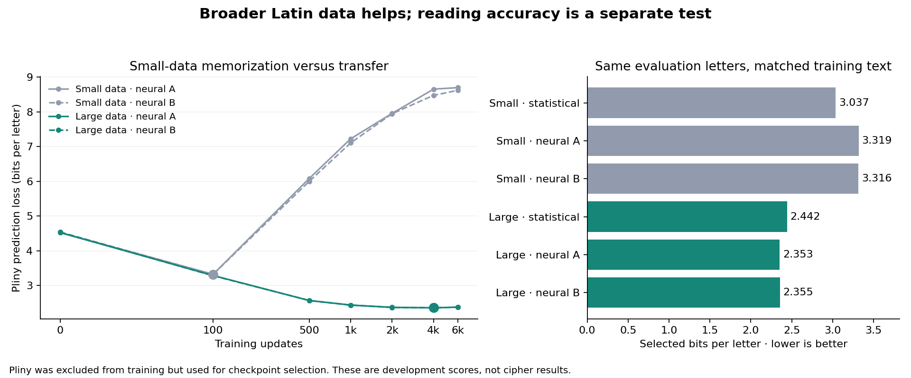

# LATIN-SOURCE-MODEL-001 results

All four fixed 7,405,079-parameter recurrent fits completed and passed saved-model audits. Both seeds used the same initial weights across data sizes. Each fit presented 49,152,000 target letters, reusing its training corpus; these are not unique training letters.

| Training data | Seed | Selected update | Pliny bits/letter | Final-update bits/letter |
| --- | ---: | ---: | ---: | ---: |
| small | 31103 | 100 | 3.319126278 | 8.700065820 |
| small | 31109 | 100 | 3.315756474 | 8.621032061 |
| large | 31103 | 4000 | 2.353183817 | 2.372643647 |
| large | 31109 | 4000 | 2.355032560 | 2.371853628 |

The matched statistical controls in the separately named compact storage revision score 3.037414669 (small) and 2.442092916 (large). Both select interpolation mass64. Small uses97,850eligible letters; large6,497,939. Every family receives identical source segments and the same359,276Plinyselection letters.

Seed31103: large data improves the selected neural source by0.965942462bits/letter; large neural improves over large statistical by0.088909099bits/letter.
Seed31109: large data improves the selected neural source by0.960723914bits/letter; large neural improves over large statistical by0.087060356bits/letter.

The original large statistical arm failed its1.2million-context cap; its full architecture screen remains UNAVAILABLE. The separate compact implementation preserves that failure and exactly reproduces all old small-data counts and scores. Applying the original effect-size thresholds to that supplementary comparison gives True. This is an adaptive source-development screen, not a reader qualification.

The small neural fits overfit strongly. The coarse common checkpoint schedule may miss a better small-data checkpoint between registered observations. These results compare the fixed recipe and budgets, not each model family at its best achievable tuning. Pliny is used for selection, so these are development losses with selection optimism, not final test estimates. Only two initialization seeds and one selection author are represented.

Audits verify every checkpoint hash and all6,000trace rows per fit, independently replay the selected full validation from disk with changed batch size, and compare128input steps with explicit double-precision LSTM gate equations. This summary independently recomputes all four step0weight hashes and checks exact data identities across families. Root-authored algorithmic checks are not independent researcher replication.

Summed neural fit wall time:3166.351s; host CPU:426.235s. GPU compute is reflected in wall time, not that host-CPU total. No paid experiment API/cloud calls; local energy unmetered. All checkpoints and raw data stay local and ignored; tracked manifests preserve full hashes.

No fresh cipher or Voynich reading is established here. The separately prepared [NEURAL-READER-001](NEURAL-READER-001.md) requires a new source/panel/prediction freeze and true-path/search diagnostics before an accuracy claim.

