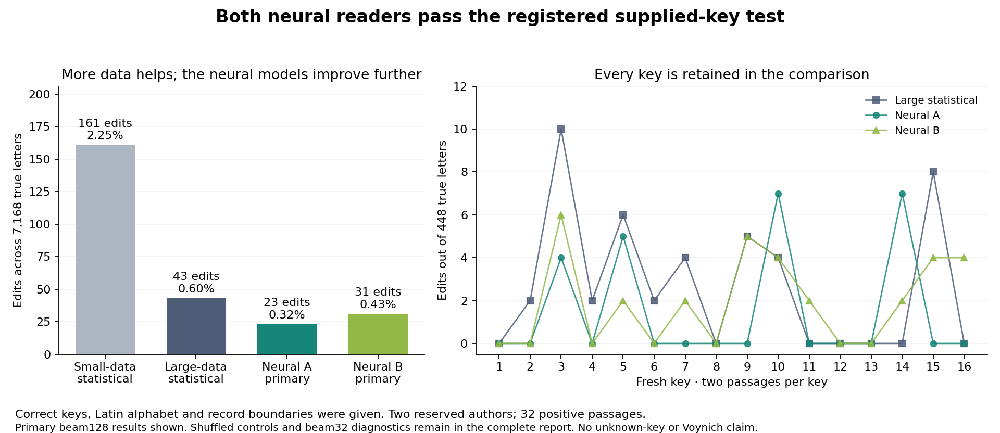

# NEURAL-READER-001 results

Joint registered reader gate: **PASS**.

All six arms read the same 32 fresh Latin passages and 32 matched plaintext-permutation controls. Correct keys, language alphabet, cipher family and record boundaries were supplied. Each positive record has 224 true letters; the decoder receives a geometric length prior but is not told that exact length. Positive denominator: 7,168 letters.

| Source / search | Positive edits | Edit rate | Exact /32 | Nepos edits /3584 | Apuleius edits /3584 | Null edits /7168 |
| --- | ---: | ---: | ---: | ---: | ---: | ---: |
| statistical-small | 161 | 2.2461% | 7 | 61 | 100 | 1324 |
| statistical-large | 43 | 0.5999% | 19 | 16 | 27 | 1773 |
| neural-31103-b32 | 20 | 0.2790% | 28 | 11 | 9 | 1887 |
| neural-31103-b128 | 23 | 0.3209% | 28 | 14 | 9 | 1925 |
| neural-31109-b32 | 31 | 0.4325% | 22 | 12 | 19 | 1926 |
| neural-31109-b128 | 31 | 0.4325% | 22 | 12 | 19 | 1970 |

The primary arms are both neural seeds at beam128; beam32 is diagnostic. No arm or source was selected from these errors. Null errors measure behavior on shuffled plaintext and do not define a language detector.

## Registered gates

**neural-31103-b128: PASS**. Edit reduction versus large statistical: 46.5116%. Keys above 5% error: [].

- every_key_cer_at_most_005: True
- overall_cer_at_most_002: True
- relative_reduction_25pct_or_both_perfect: True

**neural-31109-b128: PASS**. Edit reduction versus large statistical: 27.9070%. Keys above 5% error: [].

- every_key_cer_at_most_005: True
- overall_cer_at_most_002: True
- relative_reduction_25pct_or_both_perfect: True

## Search versus source diagnostics

Counts below cover the 32 positive records. A higher-scoring gold path demonstrates a missed better candidate. A higher-scoring wrong returned path shows that this source objective prefers an incorrect alternative. These comparisons use full-forward replays and the frozen numerical tolerance; they are not exact posterior estimates.

| Primary arm | Gold proves search gap | Wrong returned path beats gold | Beam32 beats beam128 score | Bound flag |
| --- | ---: | ---: | ---: | ---: |
| neural-31103-b128 | 0 | 4 | 0 | 0 |
| neural-31109-b128 | 0 | 10 | 0 | 0 |

Bound flags use floating scores and are not interval-arithmetic proofs. MAP optimizes exact-string probability rather than edit distance. Complete per-key errors, shuffled diagnostics and numerical margins remain in the tracked evaluation and summary.

In this panel, neither gold paths nor the narrower search demonstrate a higher-scoring alternative to the primary positive readings; that is not proof of exact MAP search. Every erroneous primary positive reading scores above its true path. Wider search therefore cannot make the truth become the MAP answer on those records with this unchanged source. Neural A beam32 makes20edits versus23atbeam128, even though its score is not better: this illustrates the difference between path probability and edit accuracy. The primary result stays23.

## Validation and limits

Every returned path re-encodes exactly. Both statistical arms have separate backward marginal/MAP and path-score checks; neural paths have full-forward score checks. All384 edit counts agree with a separate full-grid calculation. Sources were fixed before author allocation, and predictions were published before answer scoring.

This panel has two authors and16 sampled keys, not a population-wide guarantee. No unknown key or Voynich passage was decoded. Any future repair using these errors turns this panel into development data and needs a new allocation for qualification.

## Resources

- prepare: 0.058s wall, 0.058s host CPU; peak RSS 234209280 bytes.
- predict: 198.763s wall, 101.281s host CPU; peak RSS 713687040 bytes.
- evaluate: 3.475s wall, 2.029s host CPU; peak RSS 434503680 bytes.

Zero paid experiment API/cloud use. GPU time is reflected in elapsed time; local energy was not measured. Bulk readings and weights remain ignored with hashes.

