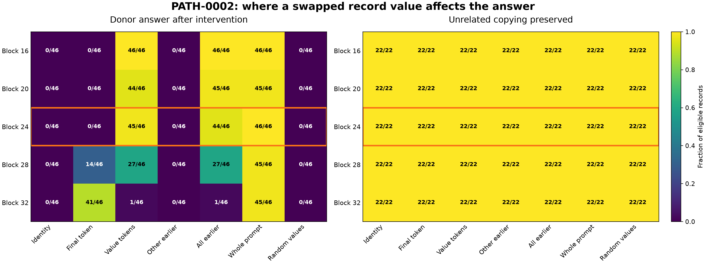

# PATH-0002: the causal control point shifts from value fields to the answer position

**Both registered exploratory diagnostics are supported on a fresh 12-bundle explicit-binding panel.** At the primary post-block site 23 (block 24), transplanting donor residual states only at token positions changed by the two record-value fields produced the donor answer on **45/46** eligible records. Norm-matched random edits produced **0/46**. Transplanting all earlier positions produced **44/46**, versus **0/46** for only the final query position. The full-prompt donor control produced **46/46**. All seven conditions preserved **22/22** baseline-correct unrelated copying controls. These are known-answer synthetic records, not Voynich text.

## Fresh inputs and controls

Twelve new name/value bundles used words disjoint from PATH-0001, with four bundles per each of three prompt templates. Every bundle supplied both queried slots and both value orientations: 48 binding and 24 copy records. The unedited model answered 46/48 binding records correctly for both source and donor with different first generated tokens, and 22/24 source copy controls correctly. The scored rows share bundles, values, reverse orientations and query structure; 46 rows are not 46 independent replications. The template-specific eligible counts were 16, 14 and 16.

An actual-Qwen3 numerical gate compared full recomputation against the cached field adapter at layers 15, 23 and 31: maximum logit error **0** in the generic probe. Every complete donor-field intervention across all 72 records and five layers matched the donor's first-token argmax; the largest full-logit error was **1.1444e-4**. Exact first-token reconstruction does not guarantee identical later generated tokens, because lower-layer KV caches still came from the source prompt. At the primary layer the complete accepted donor answer nevertheless appeared on all 46 eligible semantic records. Source identity generations reproduced their baselines throughout.

## Complete fixed layer grid

Each entry below is an accepted **complete donor answer** among the same 46 both-clean-correct binding records. Row labels are one-based block numbers; the registered primary row is block 24. The random value field has the same per-position displacement norm as the donor value field.

| Block | Final position | Changed value fields | Other earlier positions | All earlier | Whole prompt | Random value fields |
| --- | ---: | ---: | ---: | ---: | ---: | ---: |
| 16 | 0/46 | **46/46** | 0/46 | 46/46 | 46/46 | 0/46 |
| 20 | 0/46 | **44/46** | 0/46 | 45/46 | 45/46 | 0/46 |
| **24** | **0/46** | **45/46** | **0/46** | **44/46** | **46/46** | **0/46** |
| 28 | 14/46 | 27/46 | 0/46 | 27/46 | 45/46 | 0/46 |
| 32 | **41/46** | **1/46** | **0/46** | **1/46** | 45/46 | 0/46 |

Copy preservation was22/22 for **every** condition at **every** layer. The one primary value-field failure was a response containing the desired word but additional explanatory formatting, which violated the frozen exact-answer rule. No outcome-based synonym or formatting exceptions were added. At block 32, several failures similarly added explanation after a correct-looking first word; strict complete-answer scoring is retained. The value-field primary successes occurred in all 12 bundles: 11 bundles were4/4 among eligible cases and the remaining bundle was1/2. Template-specific primary value-field successes were16/16,13/14,16/16. At block32, final-position successes were14/16,11/14,16/16 across templates.

The primary value-minus-random advantage was45/46 = **97.83 percentage points**. All-earlier minus final-only was44/46 = **95.65 points**. Fixed-seed 10,000-resample **bundle** bootstrap intervals were[92.86%,100%] and[88.64%,100%], respectively. These intervals describe variability across the 12 chosen synthetic bundles; they are not a confidence interval for all language tasks or the manuscript. Both registered thresholds were exceeded, with the complete donor/copy positive controls passing.

## Mechanistic meaning and limits

Source and donor prompts have the same question and differ only in the two record values. At early and middle measured blocks, changing only the residual states at those value-token fields is sufficient to make the model answer as if the values were swapped. Changing equally large random vectors there is ineffective. Changing every earlier position **except** those field positions is ineffective at all five measured blocks. By block 28 both value-field and final-position edits can work for subsets, and by block 32 the final position dominates. The causal *site of effective control* therefore changes with depth on this task. This is consistent with a late read of value information into the answer position.

The contrast explains why PATH-0001's selected-head intervention was a weak positive control: a single block's final-position attention write is narrower than allowing a changed value-position residual to proceed through all remaining attention and MLP blocks. It does **not** prove that one attention head carries the binding, that a country-like semantic variable exists, or that a global workspace has been found. Literal value copying with a name lookup can generate the observed behavior. Multiple later-layer computations and cached routes remain unlocalized. The exact transition layer lies somewhere between the sampled blocks and is not identified here.

For decipherment, this validates a way to **test** where known information travels in a competent model. There is still no verified mapping from Voynich glyphs to values, no executable manuscript decoder, and no historical-text holdout success. A stronger mechanistic successor would isolate the attention edge from the changed value positions to the answer position, test necessity as well as sufficiency, and check fresh tasks with composition or delayed queries rather than literal copying alone. It must preserve these fresh results as exposed data, not reuse them as a new confirmation panel.

## Execution and archive

Registered source revision `7144dd7`; run `MLX_ENABLE_TF32=0 PYTHONPATH=src outputs/JSPACE-0001/venv/bin/python -u -m voynich.workspace.path2_campaign`. All **2,520** interventions completed in **1,787.51 seconds** (29m48s), peak MLX allocation **28.738 GB**, under50min/45GB caps. No weight update, new model download, paid API, external upload, or manuscript final scoring.

`results/PATH-0002/` tracks provenance, numerical qualification, clean baselines, all scored rows, layer/template/bundle summaries, decision, independent audit and the visual map. Raw rendered token IDs, residual arrays and a flushed per-row execution log remain ignored in `outputs/PATH-0002/`; all 72 baseline-array checksums verified. The independent audit recomputed the full 72×5×7 key grid, source and model/config hashes, prompt-difference positions, every output label, eligibility, aggregate decision, random-field norms and bootstrap intervals. It passed. The figure was visually inspected. Two task/decomposition tests and Ruff passed before launch; no scored implementation changed after registration. JSPACE-0001 and NEURON-0001 remain failed, ROUTE-0001 remains exploratory, and PATH-0001 remains uninformative by its own positive-control rule.
