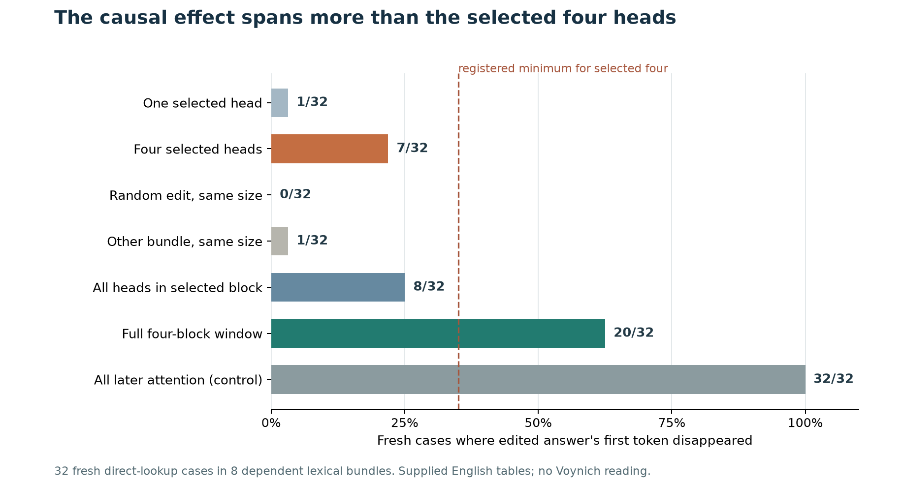

# PATH-0008 result: the four-head mediation criterion failed on fresh lookups

**Registered verdict: `exploratory_failed`.** The model performed the supplied direct lookup reliably, and the original-model numerical and whole-window controls passed. Reverting the discovery-selected four heads in zero-based block29 removed the donor first token from **7/32** eligible confirmation answers (21.88%). That missed the registered ≥35% bar and beat neither norm-matched control by the required ≥25 percentage points: Gaussian **0/32** (advantage21.88 points), cyclic mismatched-bundle head delta **1/32** (advantage18.75 points). The four-block28–31 full-attention-write control removed it **20/32** (62.50%), passing its ≥35% positive-control gate. This is a qualified negative for the *registered one-block four-head localization*, not a denial of the broader PATH-0006 attention dependency.

## Frozen panel and outcomes

Discovery reused the exposed PATH-0006 discovery lexical bundles for head selection only. It had32/32 both-clean-correct, first-token-distinct bindings and14/16 correct source-copy baselines. The post-block23 value-position edit yielded full donor answers on31 eligible bindings. All31 × four blocks28–31 ×32 heads = **3,968** single-head discovery prefills were screened by mean decrease in donor-minus-source first-token logit margin. The frozen rule selected zero-based block29 and heads **11, 6, 12, 7**. No confirmation answer contributed to that choice.

Eight disjoint confirmation bundles gave32/32 eligible bindings and16/16 source-correct copy baselines. The uncut upstream value edit gave the **full donor answer on32/32**, above the registered75% gate. Counts below use those same32 upstream-success records; four orientation/query variants from a lexical bundle are dependent.

| Confirmation intervention | Donor first token removed | Full source answer | Copy preserved |
| --- | ---: | ---: | ---: |
| Upstream value edit only | 0/32 | 0/32 | 16/16 |
| Best one head reverted | 1/32 | 1/32 | 16/16 |
| Selected four heads reverted | **7/32** | **7/32** | 16/16 |
| Norm-matched Gaussian write | 0/32 | 0/32 | 16/16 |
| Norm-matched other-bundle four-head write | 1/32 | 0/32 | 16/16 |
| All32 heads in selected block reverted | 8/32 | 6/32 | 16/16 |
| All attention writes in blocks28–31 reverted | **20/32** | **20/32** | 16/16 |
| All attention writes in blocks24–35 reverted | 32/32 | 32/32 | 16/16 |

The registered continuous diagnostic tells a more graded story. Across the32 eligible cases, the median donor-minus-source first-token logit margin was **+17.70** after the upstream edit, **+4.50** after selected-four reversion, **+18.20** under matched Gaussian noise, **+16.05** under the mismatched-bundle edit, and **−3.31** after the full four-block window cut. The selected four reduced that margin relative to upstream on **all32 cases** (mean reduction14.26 logits), yet the donor remained the generated first token in25/32. This is substantial partial causal leverage, not the registered behavioral localization criterion.

The selected-four removals by confirmation bundle were **1, 1, 2, 1, 1, 0, 1, 0 out of four**; the whole-window removals were **1, 2, 4, 4, 2, 4, 1, 2**. This variation matters more than treating32 related prompts as32 independent demonstrations. Seed-fixed bundle bootstrap intervals for selected-minus-Gaussian and selected-minus-mismatched removal were respectively **12.5–31.25** and **3.125–31.25 percentage points** (descriptive, not independent-sample confidence claims).

An exploratory overlap check illustrates why these cuts are not monotonic doses: the selected-four and all32-head block cuts removed the donor first token on **five shared cases**, plus two and three different cases respectively. All of their removals were among the full-window's20. Adding more head reversions can change downstream computation in both directions, so neither the7/32 nor8/32 rate should be treated as an additive share of the full-window effect.

The reverse diagnostic inserted the edited-run selected-four head contribution into an otherwise clean source run, **without the donor upstream value edit**. It produced **0/32 donor first tokens and0/32 full donor answers**; all32 remained full source answers. The compact summary's `reductions['reverse_four']=32` merely applies the donor-token-*removal* counter to a run that already began on the clean source side; it is a denominator artifact, not32 successful reversions. The meaningful reverse result is failure to insert the donor answer under this clean context. It does not show that those heads are irrelevant when other edited state is present. Likewise, first-token removal and full-answer restoration are separate outcomes even where their counts happen to match; all32-head reversion removed8 first tokens but restored only6 full source answers.

## Controls, provenance and limits

All registered numerical maxima were below the0.002 tolerance. The largest saved logit difference was **9.9182×10⁻⁵** for whole-donor residual transport; all-cut first-token restoration differed from clean source by at most **3.0518×10⁻⁵**; additive all-head versus full-block replacement differed by at most **5.9128×10⁻⁵**. Native head-write reconstruction errors were at most **3.1948×10⁻⁵**, and control norm mismatch at most **1.5259×10⁻⁵**. Clean write/head captures and zero-edit first-token identity had saved error0. The all-cut result is an architectural identity control for an earlier-position edit, not discovery of a special circuit.

The local Qwen3-8B-4bit run used seed510101 and dense float32 block execution. Command: `MLX_ENABLE_TF32=0 PYTHONPATH=src outputs/JSPACE-0001/venv/bin/python -u -m voynich.workspace.path8_campaign`. It completed in **1,006.62 seconds** (16m47s) with **28,727,816,280 bytes** peak MLX allocation, below the registered90-minute/45GB caps. It made no new model download, training, paid API call, or Voynich manuscript final-test score. Full frozen baseline, screen, selection, intervention and decision records are in `results/PATH-0008/`; raw arrays and rendered tokens remain ignored under `outputs/PATH-0008/`.

The independent compact audit passed all **432 confirmation rows**, labels, frozen task/rendered-input hashes, discovery selection, registered decision, and saved control bounds. Its source check treats revision `627be7960d8f5319fb4e96e80274028ab05710d8` as the **base commit**: two pre-launch amendments to the registration and campaign error/qualification reporting are preserved under `results/PATH-0008/launch-source/`, match the run's recorded SHA-256 values, and were checked against an exact allowlist; all other source files match the base commit. The audit cannot independently recompute unsaved intervention logits without rerunning the model, so numerical maxima remain runtime-enforced saved measurements.

These results concern a pretrained model answering supplied English name-to-value tables. The four-head failure, whole-window effect, and reverse-transfer failure do **not** identify a unique head circuit, a value-token attention edge, a reusable two-step key, a mechanism for Voynich production, or any manuscript reading.
