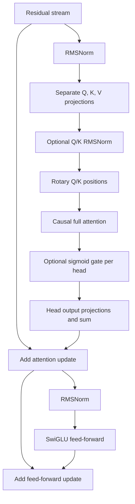

# Implemented architecture and experiment design

This is a candidate family, not a claim that its largest member is optimal or that prediction recovers meaning. Design follows the [prior-work review](PRIOR_WORK.md) and [architecture review](ARCHITECTURE_REVIEW.md). All manuscript models start from random weights and train on Voynich transcription alone.

## What is implemented

The reference model is a dense causal decoder with four layers, residual width 192, four independent heads per layer (48 dimensions each), SwiGLU hidden width 512, and 256 transcription units of context. Its parameter count is about 1.8 million, with the exact count recorded by each run. The vocabulary comes only from training pages. Embedding and readout weights are untied by default.

Each layer has the following computation:

Final RMSNorm and a linear readout predict the next unit. The optional auxiliary head predicts the unit two positions ahead from the same current hidden state. It never consumes future tokens. Its loss weight is **0.1**, an untuned project choice; the separate review discusses a possible 0.2 setting, which is not the executable default. Padding, unobserved future positions, uncertain readings, and out-of-vocabulary targets are excluded independently for each horizon. Windows never cross pages.

This is a simplified direct multi-token objective, inspired by Gloeckle et al.; it does not replicate DeepSeek's sequential MTP modules. Likewise, our optional scalar headwise gate is one specific member of the broader gating family, not an exact reproduction of every published configuration.

| Configuration | Question |
| --- | --- |
| `configs/small.json` | Is a two-layer width-128 model sufficient? |
| `configs/reference.json` | Does additional dense capacity help held-out prediction? |
| `configs/attention_only.json` | Which behavior survives removal of feed-forward blocks? |
| `configs/mtp.json` | Does a +2 auxiliary target improve prediction or identifiable copying/state behavior? |
| `configs/qk_norm.json` | Does normalizing Q/K stabilize or improve this tiny-data task? |
| `configs/gated_attention.json` | Do learned head gates improve performance enough to justify another mechanism? |
| `configs/smoke.json` | Does the implementation run end to end? This is not a model-selection candidate. |

Q/K normalization is per-head RMSNorm before rotary positions, with shared learned head-dimension scales and epsilon 1e-6. It is not L2 normalization with a learned temperature. Gates use a bias-free projection from the normalized attention input to one sigmoid value per head per position. The reference has neither option enabled. Dropout is applied to attention probabilities and residual updates during training; it is disabled during evaluation/interpretation.

The implementation uses AdamW, cosine decay after warmup, gradient clipping at norm 1, and float32. Norm scales are excluded from weight decay. Residual write matrices use initialization scaled by depth. A locked environment records exact packages; no distributed training, remote model call, or pretrained checkpoint is needed.

## Why the model remains small and dense

The corpus has only a few hundred thousand transcription units. Whether two or four layers generalize better is an experiment, not something paper recency can settle. MoE, compressed KV representations, dynamic multi-stream residual connections, and giant lookup tables would introduce additional mechanisms without a demonstrated data or compute need here. A plain residual stream also makes it possible to attribute an update to one attention head or feed-forward block.

DeepSeek, Qwen, Moonshot, and related papers informed the options and the deferred list; see the source-by-source review for what was verified. No claim of architectural novelty is made. The objective is a strong, reproducible predictor whose computations can be manipulated precisely.

## Causal inspection interface

`model(input_ids, cache_names=[...], interventions={site: function})` returns logits and requested detached activations. A function replaces the actual tensor in the forward pass and must preserve its shape/device/dtype. Unknown sites fail rather than silently doing nothing. Hooks are scoped to a single call.

Principal sites include `embed`, `blocks.N.resid_pre`, `resid_mid`, `resid_post`, `attn_input`, `attn.q_pre_norm`, `attn.q_normalized`, `attn.q`, corresponding K/V sites, `attn.scores`, `attn.pattern`, `attn.z`, `attn.result`, `attn.out`, optional `attn.gate` and `attn.z_gated`, `mlp_input`, `mlp.up`, `mlp.gate`, `mlp.act`, `mlp.out`, `final_norm`, and `logits`. Block-relative sites need the `blocks.N.` prefix.

- Q/K/V and attended vectors: `[batch, time, head, head_dimension]`.
- Attention scores/probabilities: `[batch, head, query_time, key_time]`. The scores site is **before masking**; the causal/padding mask is applied after a score intervention.
- Projected head results: `[batch, time, head, residual_width]`; summing over heads reproduces the attention update.
- Residual and MLP output sites: `[batch, time, residual_width]`.

Ordinary runs use PyTorch scaled-dot-product attention. Analysis uses explicit attention and head decomposition with the same weights. Tests require numerical parity in evaluation mode, not bitwise identity across all backends. The project supplies native hooks; it does not claim TransformerLens checkpoint compatibility.

The interpretation CLI records a clean/corrupted pair, specified next-token log probability, patch position/head, identity control, shuffled-donor control, reverse patch, absolute effects, and normalized recovery only when the original gap is sufficiently nonzero. A single pair tests plumbing and a model response; it is not a discovered circuit. Follow-up investigations need independently specified behaviors, multiple pairs/seeds, and synthetic ground truth.

## Evaluation and selection

The initial data split is determined before model outcomes and keeps physical leaves/foldouts together. Source, normalized corpus, tokenizer, and assignments have checksums. Section coverage and residual duplication limits are recorded in [DATA.md](DATA.md). Evaluation resets context at each nonoverlapping window and scores each eligible next-unit target once. This sacrifices some context at window boundaries but gives exactly matched transformer/baseline contexts.

Primary metric: mean next-unit cross-entropy in **bits per normalized EVA token**, including definite spaces, line boundaries, and EOS, excluding uncertainty and unknown targets. This is not bits per historical glyph or a tokenizer-independent entropy estimate. Per-page values are retained. Compare unigram, smoothed five-gram, and a local copy/unigram mixture under identical context/target masks.

Validation selects checkpoints and future architecture choices. The test split is not evaluated by training; a separate CLI requires `--allow-test`. Raw-file hashing and leakage audits can inspect test structure without scoring it. They do not turn the validation split into an untouched final test.

The ablation launcher produces a dry-run plan by default and requires `--execute` to launch selected bounded jobs. Initial comparison uses three seeds, matched steps/batches/context, with actual token exposure and early stopping reported. A larger model or optional mechanism earns inclusion through reproducible validation results; no complete ablation study is claimed by merely shipping configs.
