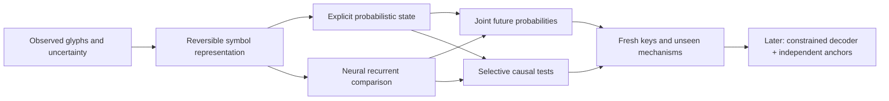

# Proposed next system and bounded experiments

Design revision 2026-09-21. **Not implemented or executed.** This document replaces “combine the latest LLM tricks” with a testable architecture comparison. The implementation currently in `src/voynich/` remains unchanged. Formal EXP registrations with frozen manifests, seeds, thresholds and a measured runtime estimate are required before scientific runs.

## What we are trying to build

A model that can infer an unfamiliar observable process from a small amount of text, maintain uncertainty about its state, and expose updates we can test. A later decoder must connect that process to independently supported meanings.

The proposed system has four separable parts:

The explicit and neural paths are competitors. They are not automatically combined into one large architecture. Sources supporting the component questions are recorded in [architecture](ARCHITECTURES.md), [interpretation](INTERPRETABILITY.md), [decipherment](DECIPHERMENT.md) and [theory](THEORY.md) reviews.

## 1. Represent the observation without attaching a permanent meaning

**Control:** retain the existing reversible glyph-unit representation and token IDs.

**Candidate:** canonicalize each episode by first occurrence, with an inverse map back to observed symbols. Add causal recurrence-distance and equality features as optional ablations. Reset the mapping only at the declared episode boundary; never recompute it from the complete suffix.

For a bijective renaming π of the observed alphabet, the target property is:

`P(π(next symbol) | π(history)) = P(next symbol | history)`.

A canonical model still needs a consistent treatment of unseen symbols. Reserve a NEW event; under a fixed known alphabet, distribute its probability equally among remaining unseen symbols unless separately observed metadata justifies a different prior. If alphabet size is unknown, predicting NEW is a different task and must not be scored as if it predicted an exact unseen glyph. Encode the inverse map and availability mask in the saved state.

This invariance removes arbitrary names; it does not remove homophony, transposition, deleted symbols or language uncertainty. Recurrence encoding is a control motivated by D13, not an assumption that the entire manuscript is a substitution cipher. Compare pure renaming of the same process separately from newly sampled transition/emission parameters.

## 2. Fit an explicit state model before a complex memory stack

Implement the edge-emitting belief update in [THEORY.md](THEORY.md). Proposed state-count grid: 2, 4, 8, 16; a one-state model is a mandatory null. Use softmax-normalized transition/emission rows, a learned initial belief and multiple random restarts. No true state count or latent labels enter selection.

Proposed interfaces:

| Interface | Required behavior |
| --- | --- |
| `initial_state(batch)` | Full state, including symbol map and adaptation state |
| `step(symbol, state)` | Normalized next-symbol distribution and updated state |
| `score_continuation(prefix_state, symbols)` | Joint log probability via sequential updates |
| `snapshot / restore` | Exact CPU reference replay within declared tolerance |
| `intervene(spec, donor, recipient)` | Precisely named state/component changes; complete provenance |

Use scaled forward probabilities or log-domain computation. Reject NaNs and malformed probability vectors. Include an ordinary node-emitting HMM only as a separate model-class control; it may require a different state budget.

A spectral/PSR comparator is second priority, after the probabilistic reference works. Check rank sensitivity, conditioning, normalization and negative probabilities rather than silently clipping and interpreting the result as a valid recovered generator.

## 3. Train the neural model to infer fresh tasks

Retain the compact causal transformer as reference. Compare a small nonlinear recurrent model with explicit before/after-state hooks. A signed/product transition model is an optional third architecture after the first two are validated; no frontier kernel is assumed to work on MPS.

A starting engineering envelope is two recurrent layers, width 128, float32; exact parameter counts will come from code, not this estimate. Match neural comparisons both by trainable parameters where feasible and by measured compute in a separate comparison. A local attention branch is introduced only as an ablation with independent branch access, not silently added to rescue failures.

Each synthetic episode samples a generator, parameters and key. The learner receives only observations and predicts later observations. Latent truth is stored separately for frozen-result diagnosis. One episode per underlying key/task group must not leak into another split. Hold out whole process families in addition to fresh keys within familiar families.

Report three distinct protocols:

1. Frozen weights with prefix-conditioned state: no parameter adaptation.
2. Declared unlabeled per-key fitting: fixed observed-prefix budget and fixed update schedule.
3. Oracle-supervised diagnostic calibration: separate upper-bound analysis, never called blind recovery.

A meta-learned predictor can receive arbitrarily many synthetic tasks. It still receives only the manuscript's actual finite evidence when transferred. External plaintext training belongs to a separately declared decoder branch.

## 4. Score combinations and state updates

Keep ordinary next-symbol likelihood. For synthetic alphabets of size at most four, enumerate all future strings through length four; sample longer continuations at lengths eight and sixteen using a frozen procedure. Larger alphabets require sampled joint log scores with reported uncertainty.

Autoregressive continuation likelihood is the core joint metric. A proposed continuation decoder conditioned on a bottleneck state may be trained to make the state sufficient; this is an ablation against ordinary AR training, not “new information” created by counting the same targets repeatedly. Match sampled target exposure and account for additional computation.

For a candidate summary φ and learned symbol update F, measure:

`φ(model state after a) ≈ F_a(φ(model state before a))`.

Do not accept a circular test where φ and F are defined so the equation holds by construction. Test whether an independently fitted summary/update predicts held-out teacher behavior and synthetic oracle futures. Compare equal-dimension output features, hidden features and PCA.

All input and state constructors must pass suffix-invariance tests: changing unseen future symbols cannot change the prefix representation. Teacher-forced scoring is allowed after the prediction for the next symbol is recorded. Open-loop forecasts and observed-symbol state updates must be named separately.

## 5. Explain a state variable, not merely a changed answer

Reuse numerical restoration and identity controls already tested in the repository. New scientific tests must isolate a variable with a known synthetic counterfactual.

Choose cases with matching immediate predictions but different later joint futures. Change only the candidate variable at the prefix, then let the model proceed normally. Compare wrong donors, equal-size random subspaces, output-span steering, shuffled counterfactual labels, an untrained model and a broad-prefix positive reference.

Measure both the intended change and preserved nuisance behavior. Test whether intervention followed by an observed-symbol update agrees with the proposed updated counterfactual. Freeze the intervention and evaluate fresh keys, prefixes and continuation strings.

Sparse autoencoders, signed dictionaries and Jacobian features enter only after a teacher demonstrably solves the task. Compare reconstruction, intervention fidelity and cross-seed subspaces separately. A more stable feature basis can still describe the wrong model behavior or the wrong historical process.

## Proposed experiment sequence

These are work packages, not accepted registrations or scheduled jobs.

| Package | Question and comparisons | Failure condition | Initial resource ceiling |
| --- | --- | --- | --- |
| P1: encoding transfer | Fixed-ID versus canonical input; fixed-key versus fresh-key episodes; same compact reference, three training seeds | Canonicalization passes algebraic renaming tests but offers no new-key predictive gain; report the distinction | 60-second hardware pilot, then at most 2 hours |
| P2: joint state inference | Explicit edge model versus transformer/nonlinear recurrence; IID, ambiguous states, delayed parity, variable copying, equivalent generators | Only first-symbol gains, no update closure, bad probability validity, or false unique recovery on equivalent controls | At most 2 hours after pilot |
| P3: selective causal state | Best qualifying teacher; independent discovery/confirmation; broad and narrow interventions | Random/output controls explain the effect, nuisance damage, or failed future updates | At most 1 hour |
| P4: representation robustness | Frozen qualified analysis on manuscript development leaves; alternate glyph/space/layout hypotheses and matched synthetic nulls | Findings depend on one transcription convention or vanish under section/layout controls | At most 1 hour; requires versioned alternatives |
| P5: anchored decoder feasibility | Known-language positive controls and bounded channel grammar; independent image/text anchors | Fluent guesses require unbounded exceptions or fail held-out exact decoding | Separate data review and budget; no run authorized by a numeric cap here |

The six-hour aggregate for P1–P4 is a proposed maximum, not a runtime prediction or a promise to run all packages. Stop after a failed gate and record why. Target at most 24 GiB measured working allocation initially and retain system headroom; RSS and Metal counters must be logged separately because they overlap. At most two concurrent GPU jobs until the pilot measures contention. No paid APIs are required for these packages.

Before running, specify task counts, data-generator versions, seeds, split hashes, primary metrics, practical-effect thresholds and uncertainty units. Cluster uncertainty by independently sampled task/key, not correlated tokens. Predeclare within-family and out-of-family outcomes separately. Thresholds cannot be chosen after inspecting final outcomes.

## The route from process inference to meaning

Prediction alone cannot assign “root,” “water” or “star” to a latent variable. A semantic decoder needs a bounded language/channel hypothesis and independent support. Plausible sources include securely aligned parallel material, positional labels, independently coded illustrations or historically grounded abbreviation conventions. Each is uncertain and must have alternatives.

A later typed decoder grammar might contain substitution, bounded expansion, explicit separators, limited omissions and state-dependent transitions. Every operation has a cost and an alignment to observed glyphs. Search proposes candidates; held-out evidence chooses among them. An unrestricted pretrained language model should not serve simultaneously as proposal generator, translator and sole judge.

Image-text work can run independently once provenance, rights, page alignment and annotation reliability are recorded. Blind motif annotation and held-out association tests should control section, layout, scribe and glyph-frequency differences. A correlation between a plant-like drawing and a text feature is an anchor candidate, not a plant name.

## What is inherited, proposed and unresolved

- **Inherited methods:** recurrence encoding, belief updates, joint likelihood, episodic prior training, causal interventions and complexity accounting all have cited precedents.
- **Our proposed synthesis:** combine fresh-task inference with equivalence-aware joint-future and selective state-update tests, then require independent manuscript anchors.
- **Existing implementation:** earlier transformer, training/data pipeline and causal tooling; none of the successor architecture is claimed complete here.
- **Open question:** whether a transferable predictive mechanism learned from our synthetic families applies to Voynich at all.
- **Promotion rule:** better manuscript likelihood alone never promotes a method to “decipherment.”

This is ambitious because it aims to infer and test rules across unfamiliar encodings. Its value will be decided by the registered controls, including informative failures.
