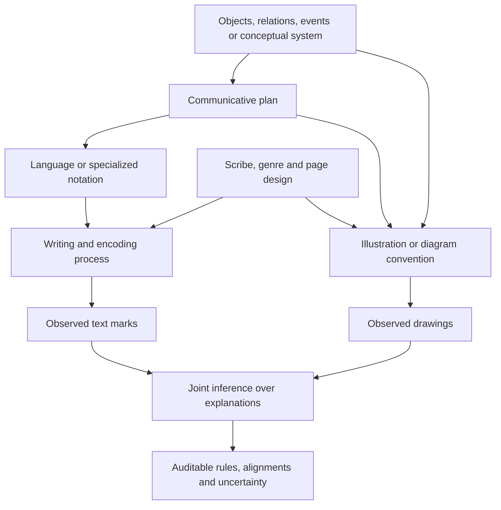

# A large research program for decipherment through world models and diffusion

**Research and ideation only — 2026-09-21.** This is a proposed program, not an implementation plan already authorized for execution, a preregistered experiment, or a claim of decipherment. The user's instruction for this task is to research and ideate without implementing or running experiments. Other work occurring concurrently in the repository is not evidence produced by this review.

## The thesis

**Yes: world models and diffusion give us a serious route worth pursuing together. The strongest formulation is a model that infers the hidden process producing a document, with diffusion as one inference mechanism and linguistics as the bridge from structure to meaning.**

The research target should be larger than a Voynich-specific predictor. It should be a reusable decipherment system able to encounter an unfamiliar writing system, infer competing generative explanations, recover relationships between its expressions and referents, and emit an auditable decoder. Voynich would be a uniquely demanding application, not the only source of training signal or the only possible scientific contribution.

This review develops five substantial bets:

1. **A foundation model for document-producing worlds:** learn how content, language, writing conventions and graphics generate observations, then invert that process in unfamiliar systems.
2. **A diffusion-based joint decipherment engine:** revise the global channel, local readings, segmentation, alignments and semantic structure together under one evidence model.
3. **An action-grounded interpretation engine:** infer executable descriptions, procedures and relational diagrams when the evidence supports those genres.
4. **Mechanistic extraction of a decoder:** turn a learned model's state updates into explicit candidate rules and test their causal role.
5. **An active research agent with a model of its own uncertainty:** choose observations that separate the surviving explanations, rather than generate ever more fluent readings.

These can be modules of one larger system. Each also has a valuable independent endpoint. Nothing in the reviewed literature demonstrates that combining them will decipher Voynich. The literature supplies component capabilities and sharp constraints; the architecture proposed here is our synthesis.

## What changes relative to the existing project

The repository's earlier review already argued for fresh-task inference, joint futures, explicit transitions and independent semantic anchors. Its recorded failures are informative: familiar-key predictive improvement did not establish unfamiliar-key recovery; broad synthetic activation patches did not establish a manuscript mechanism; larger contexts did not automatically help. See [the earlier research synthesis](../deep-review-2026-09-21/README.md), [EXP-0008](../../experiments/EXP-0008-results.md), [EXP-0009](../../experiments/EXP-0009-results.md), and [EXP-0010](../../experiments/EXP-0010-results.md).

This proposal goes beyond that scope in three ways. First, its latent object is an entire document-generating process with linguistic and referential structure, rather than only a finite-state emission process. Second, its inference is globally revisable across passages and modalities. Third, its generalization target is new systems of communication, including different scripts, grammars and graphic conventions—not just random substitutions over familiar text.

The previous null-removal models are not a foundation for claiming this harder objective is solved. Their existence can inform future engineering; their narrow synthetic task should not determine the new program's intellectual scope.

## The fields solve different parts of the problem

| Field | What it contributes | Its missing ingredient for Voynich |
| --- | --- | --- |
| World modeling | Hidden state, transitions, persistence, relations and counterfactual predictions | Which world produced the marks, and which state variables are observable |
| Diffusion and flow methods | Iterative inference, conditional generation and coordinated proposal updates | An evidence model that favors actual decoding over plausible completion |
| Linguistics | Relations among form, grammar, meaning, discourse and communicative use | Unknown language, units and writing convention |
| VLA and world-action modeling | Conditioning action on perception/language, task structure and consequences | Manuscript pages are not measured action trajectories |
| Mechanistic interpretation | Extracting and manipulating a model's internal computations | A model mechanism need not be the historical mechanism |
| Bayesian/programmatic inference | Explicit hypotheses, shared rules, uncertainty and complexity accounting | Misspecified hypothesis families and difficult posterior search |
| Palaeography and historical scholarship | Constraints unavailable from surface statistics alone | Expert time, uncertain anchors and limited comparative material |

The full [world-model chapter](WORLD_MODELS_ACTION.md), [diffusion chapter](DIFFUSION_INFERENCE.md), and [linguistics chapter](LINGUISTICS_GROUNDING.md) discuss the component evidence. [Mechanisms and identifiability](MECHANISMS_AND_IDENTIFIABILITY.md) explains the conditions under which a learned structure becomes an interpretable hypothesis.

## The hidden object should be a document-producing system

The phrase “world model” is useful only after specifying what the world contains. There are at least four candidates here:

1. **A referent world:** plants, substances, bodies, celestial relations, imagined entities, taxonomies, or other things the document represents.
2. **A communicative world:** a writer chooses which facts, instructions, distinctions or relations to express to a reader.
3. **A production world:** language, abbreviation, glyph realization, copying, layout and possible encryption turn that message into visible marks.
4. **An epistemic world:** a modern solver maintains beliefs, edits a hypothesis and obtains more evidence.

A good predictor of the third might capture handwriting or copying without recovering the first. A capable agent in the fourth might organize research without ever learning the language. Keeping them separate lets us combine their capabilities without confusing the conclusions.

The forward model we want to invert is conceptually:

This is a proposed generative graph, not a recovered history. In particular, the drawings may only weakly relate to the text, may have been copied from another source, or may serve a nonreferential function. Nonsemantic alternatives have their own forward models and remain full competitors.

## A concrete joint inference target

Let `H` collect the document-level hypothesis: linguistic or nonlinguistic family, writing/channel program, lexicon or key, graphic conventions, and rules for variation by scribe or section. For each page `p`, let:

- `Z_p` be a latent entity/event/diagram structure;
- `U_p` be a linguistic or notational realization;
- `R_p` be a possible reading of the marks;
- `A_p` be alignment, expansion, omission or null assignments;
- `S_p` be the production-state trajectory;
- `X_p` be the observed text raster, `I_p` the illustration, and `D_p` the observed layout/metadata.

An illustrative factorization, conditioned on `D`, is:

`p(H, Z, U, R, A, S | X, I, D)`

`proportional to p(H) × product over pages p of`

`p(Z_p | H, D_p)`

`× p(U_p | Z_p, H, D_p)`

`× p(R_p, A_p, S_p | U_p, H, D_p)`

`× p(X_p | R_p, H, D_p)`

`× p(I_p | Z_p, H, D_p)`.

This specifies the scientific question more precisely than “use diffusion.” Which parts are neural, symbolic or integrated out is an architectural choice. Cross-page references and copied material would introduce additional dependencies. The conditional independences above would need scrutiny; they are not facts about the manuscript.

When working from a transcription, the text-image likelihood can be replaced by an explicitly uncertain transcription observation model. Multiple transcriptions of the same ink are correlated measurements, not independent manuscripts. Counting a scan, its transcription and an AI-generated description as three independent supports would manufacture evidence.

Several consequences follow:

**Global variables must stay global.** A key or abbreviation rule chosen on one page constrains its uses elsewhere. A model that quietly assigns each difficult paragraph a new codebook has abandoned the core explanatory task.

**Uncertainty belongs in the joint state.** If a glyph might be one sign or a ligature, downstream segmentation and lexical hypotheses should branch accordingly. A hard OCR error at the front should not force a confident translation at the back.

**Every additional degree of freedom has a cost.** Channel operations, exceptions, state changes, codebooks and deletion decisions need explicit priors or a disclosed description-length accounting. “Unexplained” is not equivalent to “filler.”

**Likelihood and fluency are different.** A natural-language prior prefers coherent prose. The observation model asks whether that prose, under the stated rules, would produce the actual marks. A useful solver needs both, with the latter able to defeat the former.

**Re-encoding is necessary but insufficient.** A program containing the manuscript as a literal constant reconstructs it perfectly. Flexible paired encoder/decoder networks can also invent private codes. Reconstruction matters only alongside restricted complexity, independent prediction and stable shared rules.

## Bet 1: a foundation model for unfamiliar systems of communication

### The idea

Train on a broad distribution of *document-producing worlds*. Each world has entities and relations, a communicative purpose, linguistic or notational realization, writing conventions and a set of observations. The learner receives unfamiliar observations and infers their hidden organization. Across worlds, alphabets, typology, channel families and depiction conventions vary independently wherever possible.

The same content might appear as a description, a list, a diagram, a procedure, a label set or a compressed technical entry. Conversely, very similar surface statistics might arise from unrelated content or a nonsemantic copying process. The learner must infer which explanation is supported.

The training distribution would combine several distinct sources of supervision:

| Material | What it could teach | What it cannot honestly supply |
| --- | --- | --- |
| Solved historical ciphers and writing systems | Real channels, errors and human conventions | Universal coverage or independence from known solutions |
| Typologically diverse natural-language corpora | Morphology, syntax, discourse and lexical distributions | A semantic alignment merely because two texts concern similar topics |
| Grounded scene/procedure datasets | Entity, role, state-change and reference tracking | Medieval genre knowledge by default |
| Generated symbolic worlds with known mechanisms | Exact interventions, fresh keys, ground truth and deliberately ambiguous cases | Historical realism merely through scale |
| Comparative manuscripts with expert annotations | Writing, illustration and genre conventions | Permission to identify a Voynich plant from resemblance |

This is a data and representation program as much as a training program. A thousand language labels with a few translated sentences each does not automatically supply diverse grammar, genres, orthographies or historical writing processes. Mechanical romanization can erase distinctions precisely where the inference task needs them.

### Why it could work

Our inference is that one short manuscript may suffice to select and adapt a rich prior learned elsewhere, even though it cannot train that prior from scratch. Modern world-model, representation-learning and program-induction results supply precedents for parts of that transfer; none supplies a complete proof. The learner's valuable skill is rapid inference of unfamiliar rules, not recollection of Voynich-looking phrases.

The shared latent representation should have several consumers: predict observations, render another view, answer structural queries, infer missing relations and interpret a candidate action. This discourages a representation whose only useful property is next-character prediction. Conditional identification results motivate multi-task structure while retaining strong assumptions; see [M04](https://arxiv.org/html/2502.09297v2).

### What makes this ambitious

The endpoint is a general model for inferring communication systems, closer to a scientific instrument than a single classifier. It would need to learn across entire grammars and production processes, keep track of novelty and ambiguity, and produce explanations other systems can execute. The most scientifically valuable representation may combine a powerful neural encoder with a much smaller explicit hypothesis state.

### Where it can fail

The model can learn the simulator designer's habits. A generated world's “language” may be a disguised English template; its drawings may leak labels; its supposedly held-out mechanisms may be compositions already exposed during training. External training can also contaminate evaluation through published Voynich solution claims or benchmark translations.

The decisive capability is inference of a genuinely unfamiliar system from limited observations. Scaling cannot be credited for that capability if success depends on remembered answers, leaked key families or unrealistically informative images.

## Bet 2: diffusion over the entire explanation

### The idea

Use diffusion or discrete flow methods to propose a *joint latent explanation*, not to turn Voynich-looking strings into fluent sentences. The evolving state includes global rule variables, local readings, alignments, uncertain segmentation and a semantic/event graph. The actual observations remain fixed.

A plausible inference cycle would alternate globally coordinated updates:

1. Propose or revise the channel and language-family hypothesis.
2. Update local segmentation and alignment under those rules.
3. Reconcile repeated forms, references and cross-page constraints.
4. Update candidate semantic structures and their visual relationships.
5. Check the proposal through a separately specified observation model and retain competing modes.

These are conceptual operations, not an implementation or a promised exact sampler. The [diffusion review](DIFFUSION_INFERENCE.md) distinguishes valid probabilistic targets from heuristic guidance and explains why generic masked diffusion does not automatically support revising committed tokens or variable-length sequences.

### Why diffusion is attractive here

Decipherment has strong mutual dependence: the key changes the words, the words constrain segmentation, segmentation changes morphology, and morphology changes the plausible key. A sequence generator making irreversible early choices can be awkward for this structure. An inference method that can revise a whole configuration is a natural candidate.

Global revision is not exclusive to diffusion. MCMC, message passing, beam search with backtracking, variational inference and program search can address similar dependencies. The relevant claim is that learned denoising proposals might navigate the enormous structured search space efficiently while keeping alternative explanations alive. That must be demonstrated, not assumed from image quality or modern-language benchmarks.

### The symbolic compiler is essential

A continuous embedding between two glyph classes is not a third historically meaningful glyph. A soft key matrix that assigns the same plaintext symbol to incompatible observations is not a valid discrete key unless the channel explicitly permits it. Relaxation can help search; the final object must satisfy the selected grammar and channel constraints.

The proposed interface is therefore a neural proposer plus an independently implemented rule executor. A proposal should compile to a document-level channel, latent message, complete alignment and a list of unresolved alternatives. Depending on the family, the executor could be a finite-state transducer, grammar, bounded program or explicit relational model. Diffusion is the search engine; compilation gives the result scientific content.

### Why images belong in the posterior rather than the prompt alone

An image model shown a plant-like drawing may produce botanical language under its prior. If that language becomes the translation prompt and a similar model then judges the answer, the apparent agreement is circular. A more useful connection is a latent relational claim—such as a recurring part appearing in several diagrams—that constrains the same variable across independent text observations.

A proposal might predict that one form consistently distinguishes a whole object from a part, or that an illustration-specific relational feature corresponds to a grammatical construction. Such claims can be grounded without identifying a species. The semantic label may remain anonymous until stronger evidence arrives.

### Where it can fail

An excellent sampler of the wrong posterior will produce excellent wrong answers. Guidance toward a preferred language can destroy uncertainty. Large neural likelihoods may be incomparable across families. Repeatedly selecting the prettiest sample adds an unrecorded search bias. A valid output requires a frozen selection rule and independent consequences, not a winning screenshot from thousands of samples.

## Bet 3: action-grounded, executable interpretation

### The idea

For genres that describe procedures, reinterpret decipherment as inverse modeling of a program over entities and states. The text may describe operations; images may depict participants, parts, configurations or outcomes. An action model supplies a vocabulary of possible transitions and a means to check their relational coherence.

The output need not immediately be an English sentence. A candidate could initially be:

`operation_3(part(entity_A), entity_B) -> state_7`

with uncertain lexical realizations. This is an invented explanatory example, not a reading of any manuscript token. It makes an ambitious point: recovering a stable executable relation could precede recovering the words used to name it.

The relevant inspiration from VLA systems is the connection between perception, language and structured action. It is not a claim that a pretrained robot controller can read medieval text. A robot's joint coordinates and action statistics are usually irrelevant here; state persistence, entity binding, goal conditioning and compositional task structure are the potentially transferable ideas.

### More than a recipe hypothesis

Several different executors may be appropriate:

- **Procedural:** materials and operations with preconditions and effects.
- **Taxonomic:** objects, parts and distinguishing properties.
- **Astronomical or calendrical:** relational diagrams, cycles and correspondence rules.
- **Mnemonical or pedagogical:** ordered reminders whose interpretation depends on reader knowledge.
- **Communicative:** selecting which distinction a reader must recover.

No single executor should be silently forced across the entire manuscript. A recipe executor can manufacture recipes from noise when a flexible language model supplies the missing material. Genre selection is part of the hypothesis, and alternatives must remain possible.

### What a world-action model adds

It can ask whether a proposed interpretation tracks the same entity through several operations, whether a state required by a later operation was established earlier, and whether two passages describe equivalent processes with different surface realizations. These are relational constraints that a bag-of-words language score largely misses.

It can also identify where a reading depends on an unstated operation or an unobserved ingredient. That does not automatically falsify historical text—real instructions omit shared knowledge—but it puts the missing assumptions into the explanation rather than hiding them in fluent prose.

Physical correctness must not become an anachronistic truth filter. A medieval author may communicate a procedure that is ineffective or based on a false theory. The target is a coherent account of the author's conceptual system and writing, not compulsory agreement with modern chemistry or medicine.

### Inverse communication as a second route

A writer's choice of abbreviation, redundancy or diagram can be modeled as an attempt to communicate under constraints. An imagined reader reconstructs the relevant state or action; the writer balances effort and ambiguity. This connects pragmatics to inverse planning and information-theoretic coding.

The powerful possibility is a pressure toward a small reusable code rather than page-specific invention. The danger is unlimited flexibility in the writer's utility or reader's prior. The full [linguistics chapter](LINGUISTICS_GROUNDING.md) and [mechanisms chapter](MECHANISMS_AND_IDENTIFIABILITY.md) develop this distinction. Inverse planning supplies a formal inspiration, not evidence for the historical author's intention. [M14](https://web.mit.edu/9.s915/www/classes/cognition2009.pdf)

## Bet 4: extract the model's decoder and causal variables

### The idea

Use mechanistic interpretation to discover whether the model has learned an internal interpreter. Candidate variables include referent identity, grammatical features, pending dependencies, channel state and copy pointers. Extract their updates into a compact program, then ask whether that program makes the model's behavior intelligible and transfers to unfamiliar instances.

This direction has a strong conceptual precedent in sequence-model studies of known games. Those studies demonstrate that hidden state can be represented and causally relevant; they also show that choosing the right representational frame matters. They do not eliminate the need for known ground truth during method development. [M01](https://arxiv.org/html/2210.13382v4), [M02](https://aclanthology.org/2023.blackboxnlp-1.2/)

The proposed causal atlas asks whether replacing a variable changes exactly the consequences it should. Changing a referent should affect its later mentions, while changing the hand should affect appearance. Changing the encoding key should alter observed spellings while preserving the underlying relations. These conditions define a useful abstraction more precisely than feature names chosen by another model.

For diffusion, the interpretation must follow the evolving hypothesis across denoising steps. Does contradictory evidence revise an early guess, or merely provoke a new explanation that preserves it? For an action model, do updates reflect genuine state changes, or a memorized sequence pattern? For an inferred writer, are channel rules shared across all relevant passages?

### The major research output

A system that can produce a small interpreter explaining a powerful neural model across unfamiliar symbolic worlds would be significant on its own. For Voynich, that interpreter would become a candidate decoder requiring historical validation. Mechanistic faithfulness to the network and faithfulness to the manuscript's origin remain different achievements.

The [dedicated chapter](MECHANISMS_AND_IDENTIFIABILITY.md) develops this proposal, its intervention vocabulary and its connection to causal abstraction, conditional identification, program induction and posterior uncertainty.

## Bet 5: a model of the research process itself

### The idea

Give the research agent a belief state over explicit competing explanations. Its actions acquire or analyze evidence: inspect another occurrence, compare independent transcriptions, request blind annotation of a motif, examine a historical abbreviation source, or investigate a predicted cross-page correspondence.

It forecasts the possible outcomes and their effect on the hypothesis distribution. The objective is to choose observations that separate alternatives. This is the most literal action-based world model available in the present setting: we can actually take those actions and observe their results.

### Why this is more than agentic browsing

A generic agent can accumulate papers indefinitely or reinforce a favorite theory. A research world model should represent why a piece of evidence matters. Suppose hypotheses A and B both explain a common repeated form, but disagree about how it should behave on labels versus running text. The most useful next inspection is an independent set of such occurrences, not another convincing paragraph under A.

Some actions resolve reading uncertainty; others reduce search uncertainty; only some discriminate historical explanations. The system must label the distinction. Calling a model repeatedly does not acquire new manuscript evidence. Generating synthetic evidence from the favored hypothesis does not validate that hypothesis.

The valuable endpoint is an auditable chain of changing beliefs, with the information source and independence of each update recorded. A human expert can then see exactly which disputed glyph or historical assumption supports a conclusion.

## How the bets fit together

| Component | Input | Output | Why it is needed |
| --- | --- | --- | --- |
| Perception with uncertainty | Scans, transcriptions, layout | Candidate readings and relational visual features | Avoid turning ambiguous evidence into false certainty |
| Communication-world prior | External known/constructed systems | Prior over semantic, linguistic and production structures | Supply transferable knowledge absent from one manuscript |
| Joint inference engine | Evidence and prior | Multiple global/local explanation candidates | Resolve mutually dependent unknowns |
| Rule compiler/executor | Candidate channel and message | Observation alignment, predictions, explicit exceptions | Make explanations independently checkable |
| Mechanistic extractor | Qualified learned model | Candidate state variables and update programs | Explain what the learner actually uses |
| Research policy | Surviving explanations and uncertainty | Next informative evidence request | Spend effort where explanations disagree |

The model need not perform all of these in one giant latent vector. A modular architecture makes different error sources visible. A shared representation is useful where the variables genuinely overlap; excessive sharing can instead spread a wrong language assumption into the visual analysis and back again.

## What would count as a breakthrough

The program should aim at recognizable scientific achievements, rather than a staircase of tiny loss improvements:

**Universal inference capability.** Given a previously unseen writing/channel family and limited observations, recover its transferable rules or correctly describe the remaining ambiguity. This requires diversity at the system level, not just more sequences.

**An executable, accountable manuscript explanation.** A fixed set of rules accounts for the visible material with explicit alignments and bounded exceptions, and can be applied by someone other than its creator.

**Independent semantic traction.** The interpretation makes accurate predictions about evidence not used to invent it: for example, relational correspondences across sections, independently annotated image structures, or securely identified external material. Merely matching a broad “botanical” topic is too weak.

**A durable choice among explanation families.** The model must outperform strong structured nonsemantic, copying, abbreviation and alternative-language explanations under comparable complexity and observation coverage. Its uncertainty should remain when the evidence cannot decide.

These are large program-level targets. They do not prescribe another series of small experiments in this task. Validation is the evidential specification of the ambition, not a substitute for it.

## Scale: where a serious investment would go

The useful scale is **world diversity, linguistic depth, independent evidence and inference capability**. Model size and compute serve those goals. The reviewed video and robotics results often operate at scales and supervision levels far beyond a single manuscript; copying their architecture does not copy their evidence supply.

An eventual foundation-model proposal could plausibly explore hundreds of millions to a few billion trainable parameters, supplemented by larger frozen perception or language priors. That is an architectural planning range, not a measured requirement or a spending recommendation. The right size depends on the actual tasks, corpus quality, transfer regime and training recipe. It may be more effective to adapt substantial existing components and devote resources to the joint inference and comparative data.

The largest scientific costs may be collecting and annotating genuinely diverse systems, constructing credible production models, maintaining independent evaluations, and obtaining expert historical constraints. Arbitrarily generating billions of near-identical English-derived examples does not solve those problems.

The repository's local machine is useful for data inspection and portions of future inference. Its previously reported specifications do not establish the feasibility of frontier video-model training. Reported API credits are not GPU capacity and are not authority to spend them. This review launches no jobs, buys no compute and acquires no paid access. A later execution proposal would need measured throughput, exact artifact licenses, a finite resource envelope and explicit deliverables.

## Ranking the ideas

These rankings are research judgments, not measured performance or probabilities of success.

| Direction | Decipherment relevance | Main technical risk | Judgment |
| --- | --- | --- | --- |
| Joint latent-language/channel inference with a rule executor | Direct | Huge search space and wrong priors | Core of the program |
| Externally trained model of document-producing systems | Direct but long-horizon | Transfer from artificial/known systems to historical unknowns | Best large investment if data quality is real |
| Diffusion/edit-flow proposals inside that system | Direct inference tool | Constraint violations, poor posterior coverage, costly sampling | Strong contender; keep serious alternatives |
| Causal extraction of learned state and rules | Explains and compresses hypotheses | Faithful teacher explanation can still be historically wrong | Integral research track |
| Action-grounded event/procedure interpretation | Potentially strong for suitable genres | Forcing a genre or modern ontology | High-upside conditional branch |
| Active evidence selection | Directly improves research efficiency | Misestimated information gain and dependent evidence | Valuable coordinating layer |
| Direct adaptation of an off-the-shelf robot VLA to pages | Weak without task redesign | Missing actions, missing grounding and domain mismatch | Architectural inspiration rather than the main route |
| Unconstrained image/text generation judged by plausibility | Poor historical evidence | Circular agreement and hallucination | Useful only as proposal material, never the arbiter |

## Open questions worth serious theoretical work

1. Under which channel and weak-grounding assumptions can latent semantic relations be identified before lexical meanings?
2. Can one inference model transfer across fundamentally different writing systems without erasing their distinctions through preprocessing?
3. Which globally constrained discrete sampling methods preserve competing keys and grammatical analyses at manuscript scale?
4. Can a learned model's latent update rules be extracted in a form that generalizes across symbol renaming and mechanism changes?
5. How much independent information do illustrations, labels and layout actually add after scribe/section effects are accounted for?
6. Can an inferred reader model discriminate learnable shorthand from structured pseudo-writing without assuming its conclusion?
7. What evidence would identify a semasiographic or mixed notation when a natural-language decoder is inappropriate?
8. Can the system recognize that all of its candidate families are wrong, instead of becoming confident in the least bad one?

The strongest current bet is the combination: a model of document production, globally revisable inference, an explicit rule executor, and genuinely independent grounding. Diffusion supplies a promising search mechanism; world models supply structured hidden processes; linguistics defines the layers connecting marks to communication. The proposed system earns a decipherment claim only when those pieces converge on rules another person can use and evidence those rules correctly predict.
